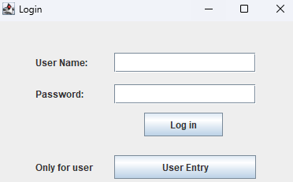
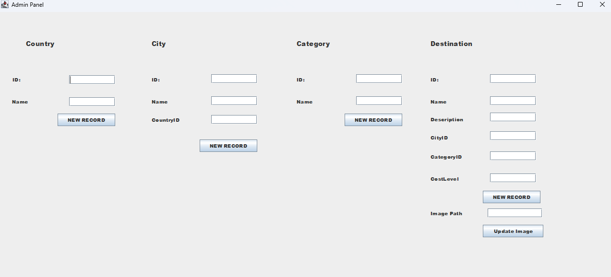
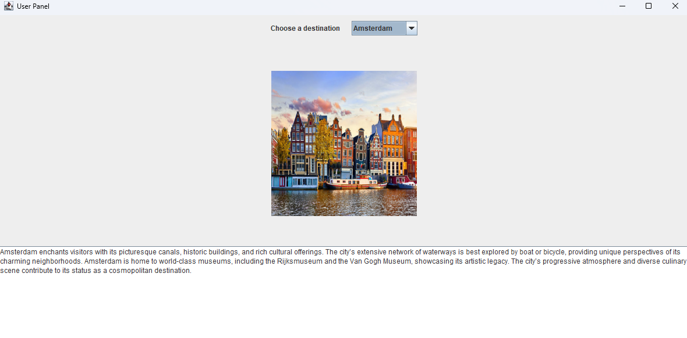

# 🌍 TravelGuide-Desktop-App
A desktop application for managing travel destinations using Java Swing and SQLite with a layered architecture.


## 📸 Screenshots

| Login Screen | Admin Panel | User Panel |
|:---:|:---:|:---:|
|  |  |  |

## ✨ Features

### 🔐 Authentication
- Secure login system with role-based access (Admin vs. User).
- **Admin Credentials:** `admin` / `1234` (Default).

### 🛠 Admin Panel (CRUD Operations)
- **Add New Data:** Admins can add Countries, Cities, Categories, and Destinations dynamically.
- **Update Records:** Update image paths and details for existing destinations.
- **Database Management:** Automatically creates necessary tables if they don't exist.

### 👤 User Panel
- **View Destinations:** Browse available travel spots loaded from the database.
- **Dynamic Filtering:** Select a destination to view its description and image.
- **Visual Interface:** Displays images associated with locations.

## 🏗 Tech Stack & Architecture

* **Language:** Java (JDK 17+)
* **GUI:** Java Swing (JFrame, JPanel, LayoutManagers)
* **Database:** SQLite (Lightweight, serverless)
* **Data Access:** JDBC with `PreparedStatement` (Prevents SQL Injection)
* **Pattern:** Layered Architecture (GUI -> DatabaseHelper -> Database)

## 🚀 Installation & Setup

1.  **Clone the repository**
    ```bash
    git clone [https://github.com/hakancebe/TravelGuide-Desktop-App.git](https://github.com/hakancebe/TravelGuide-Desktop-App.git)
    ```
2.  **Open in IDE**
    - Import the project into Eclipse, IntelliJ IDEA, or NetBeans.
3.  **Add Dependencies**
    - Ensure `sqlite-jdbc-xxxx.jar` is added to your project's **Build Path / Classpath**.
4.  **Run the App**
    - Locate `Main.java` and run the file.
    - The database `gui.db` will be created automatically in the project root.

## 📂 Database Schema

The application uses a relational database with the following structure:
* **Users:** Stores login credentials.
* **Country:** Parent table for countries.
* **City:** Linked to Country via Foreign Key.
* **Category:** Types of vacations (e.g., Summer, Winter).
* **Destination:** The main table linking City, Category, and descriptions.

## 👨‍💻 Author

**Hakan Cebe**


---
*This project was developed for educational purposes to demonstrate Java Desktop Application development skills.*
